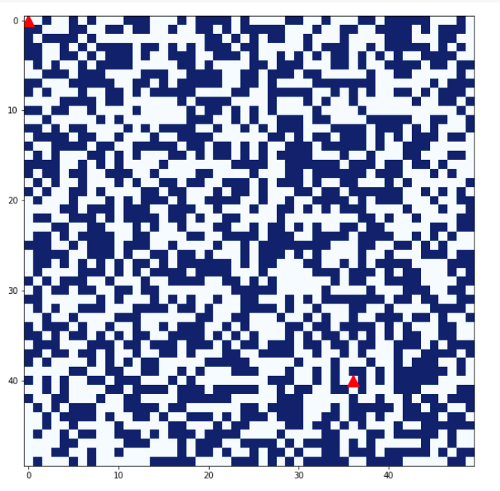
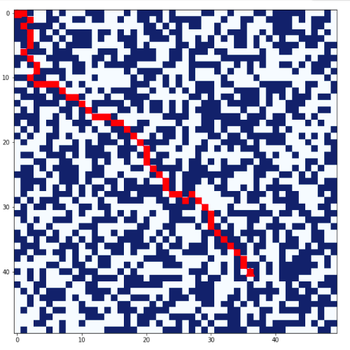
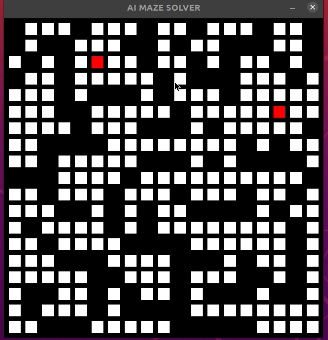

# A--AI-Maze-solver
Implementation of A* algorithm (in Python):an artificial intelligence problem used for the path-finding &amp;the Graph traversals

Visualizing maze drawn and path found in matplotlib:

GUI-based Maze-Game using AI solver

